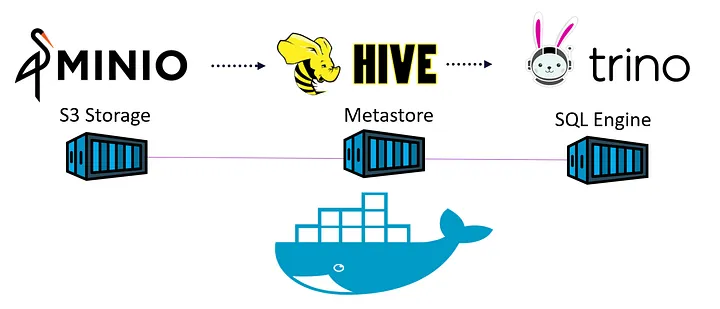

# Tutorial DataLake MinIO S3 + Trino + Docker + Hive MetaStore

Resumen.

|pasos|descripcion|
|-----|-----------|
|1 |Setup infrastructure for on-premise data lake|
|2|Configure a S3 bucket in MinIO S3 compatible storage, Hive Metastore and Trino SQL engine
|3|Create external tables and Query data lake data using Trino|
|4|Complete code is available on GitHub. Accompanying video tutorial is available on YouTube.|
|LINK|[https://aws.plainenglish.io/build-your-own-data-lake-on-your-infrastructure-c5015658b237]()|


1. [Introduccion](#1.Introduccion)
    - [MinIO](#1.1-MinIO)
    - [Hive MetaStore](#1.2-Hive-MetaStore)
    - [Trino](#1.3-Trino)
2. [Creacion de Buckets](#2.-creacion-de-buckets)
3. [Creacion de esquemas y tablas](#3.-creacion-de-esquemas-y-tablas)
4. [Query con Trino](#3.-Query-con-trino)

## 1. Introduccion

En este ejemplo vamos a crear un DataLake local usando distintas herramientas.
Primero creamos un Docker-COmpose con los servicios __MinIO__ __Hive MetaStore__ y __Trino__ 



Es importante para este proyecto tener compilado las carpetas __conf__ __etc__ y __s3 jars__ en el directorio donde se encuentra __docker-compose__

### 1.1 MinIO

MinIO S3 nos permite crear nuestro Storage Layer a nivel local. Tiene como caracteristicas que es escalable y seguro. Para poder acceder necesitamos crear una clase de seguridad.

### 1.2 Hive MetaStore

Para opder acceder a los datasets primero debemos mapearlos y guardar esa informacion de mapeo de una BD. EN este caso vamos a usar MAria DB (Pero puede ser otra) donde se guarda toda la metadata. Esta __Metadata__ es necesaria para que Hive pueda procesar estos archivos ya que la misma contiene,  ubicación, sub-carpetas, tipo de datos y esquema.


### 1.3 Trino

Es un motor de SQL de consultas distribuido. Utiliza una arquitectura similar a la de los sistemas de Massive Parallel Processing (MPP) para acceder a grandes datasets.


### __DataLake__

```
Un Data Lake es un repositorio centralizado para almacenar datos Structurados y no Estructurados y utilizarlo como fuente de consultas analíticas o modelos de ML.
```

## 2. Creacion de Buckets

Antes de poder crear un Bucket debemos inciar todos los servicios.

```
docker-compose up -d
```

Levantados todos los servicos ingresamos a __MinIO__ para crear nuestro Bucket.

|link|usuario|
|----|-------|
|[http://localhost:9001/]()|minio_access_key minio_secret_key|

Dentro del nuevo bucker __alumnos__ tiramos los dos archivos .csv


## 3. Creacion de esquemas y tablas

Una vez creado el Bucket es necesario debemos __mapear los archivos S3 con Hive MetaStore para luego poder hacer SQL sobre los mismos__

|link|usuario|
|----|-------|
|[http://localhost:8086/ui/]()|usuario: trino|

```sql
CREATE SCHEMA IF NOT EXISTS minio.alumnos
WITH (location = 's3a://alumnos/');
```

Esta sentencia lo que hace es crear un Squema en la MetaStore que apunta a nuestro Bucket "Alumnos" en S3.

Una vez hecho esto creamos la tabla __Externa__
Para esto definimos el nombre de la tabla, tipo de datos, columnas y con la sentencia __WITH__ hacia donde apunta y el tipo de archivo (.csv o parquet).

```sql
CREATE TABLE IF NOT EXISTS minio.alumnos.alumnos_tabla (
  Nombre VARCHAR,
  Apellido VARCHAR,
  nota VARCHAR
)
WITH (
  external_location = 's3a://alumnos/',
  format = 'CSV'
);
```

```
Como el archivo es .csv solo pueden ser datos VARCHAR
```

## 4. Query con Trino

Una vez creada la Metadata y la Tabla Externa podemos hacer querys contra la misma.

```sql
select nombre, apellido, nota,
dense_rank () over(order by nota desc) rk
from minio.alumnos.alumnos_tabla 
```

